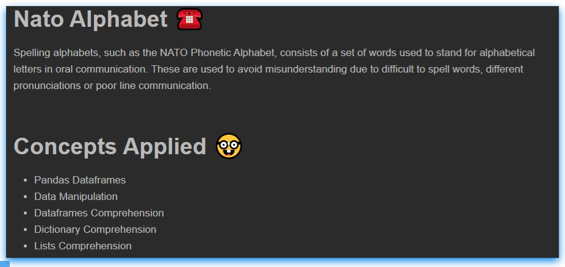

# Nato Alphabet ☎️
Spelling alphabets, such as the NATO Phonetic Alphabet, consists of a set of words used to stand for alphabetical letters in oral communication. These are used to avoid misunderstanding due to difficult to spell words, different pronunciations or poor line communication.

# Concepts Applied 🤓
- Pandas Dataframes
- Data Manipulation 
- Dataframes Comprehension
- Dictionary Comprehension
- Lists Comprehension

# Code Sneak Peek
